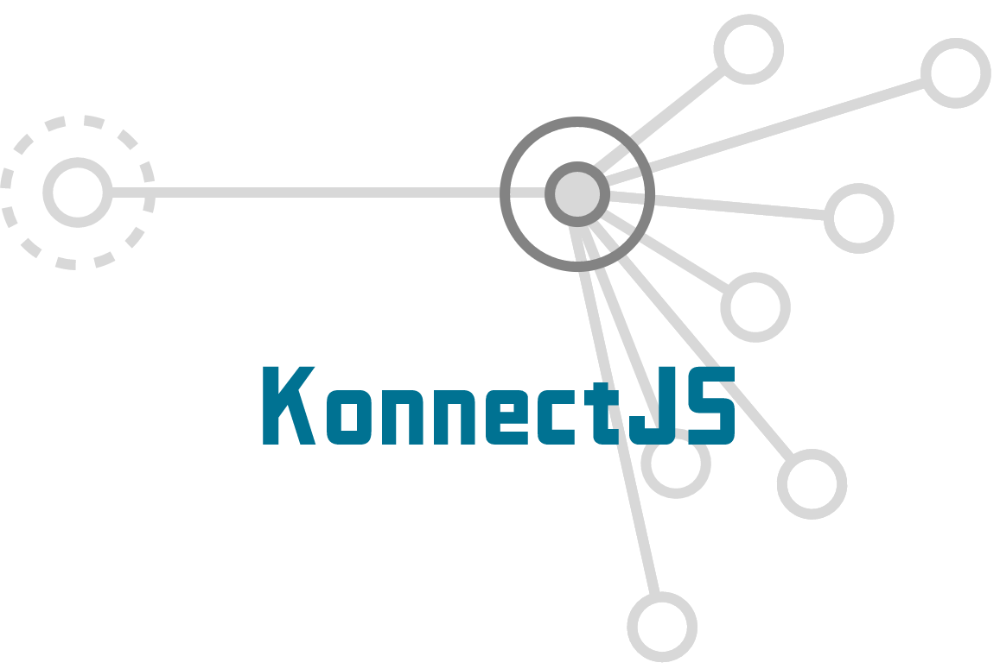

[简体中文](docs/zh-cn.md)

An extremely flexible abstraction of node-connections structure, which designed for keep-in-connection using, can be fit with any type of network protocol

this work is still in progress.

<!-- vscode-markdown-toc -->
- [Concepts](#concepts)
  - [Konnection \& Knode](#konnection--knode)
  - [Impl](#impl)
- [Features](#features)
- [Installation](#installation)
- [Getting Started](#getting-started)
  - [Start A WebSocket Server](#start-a-websocket-server)
  - [Start A Tcp Server](#start-a-tcp-server)
  - [Remember The Connection](#remember-the-connection)
  - [Run without Impl](#run-without-impl)
  - [Flexible Connections](#flexible-connections)
- [Cascade Midwares](#cascade-midwares)
- [Custom Midwares](#custom-midwares)
- [Extend Implement](#extend-implement)

<!-- vscode-markdown-toc-config
	numbering=true
	autoSave=true
	/vscode-markdown-toc-config -->
<!-- /vscode-markdown-toc -->

## Concepts

### Konnection & Knode

KonnectJS has two major concepts, which are 'Konnection' & 'Knode'. 
'Konnection' is for the same pronounce as 'Connection'(similarly hereinafter). 
'Knode' is for the same pronounce as 'Node'(similarly hereinafter). 
The ends of a connection are nodes. A node may has lots connections.

### Impl

KonnectJS is only aware of the abstract structure. We just tell it what to do when a connection on establish, closed, transfer or error occurs. That is to say, the Konnect dont drives itself. We should set a event-based driver by calling `setImpl`. 
For the most time, a impl is something like network protocol. However, that is not to say that Konnect can only deal with networking using.


## Features

For business coders, the only thing to think about is to defines how the node acts with connection events, such as:

* connection - a new connection established
* close - a connection is close by some reason
* data - some data is transfered from a connection
* error - an error occured on a connection

Sometimes, there is no sense for business coders to worry about what protocol to use, what format the data is, how data is encrypted, even how the connection is established and so on. The followings are only one line code needed to set what the system consist of without any other code modification:

* set what communication protocol to use with only one line code. such as `websocket`, `tcp`, `udp`, `sse`, `polling`, `kcp`, `http3` or custom communication implement, see [Extend Implement](#extend-implement)
  
* set what format of the data transfered from the connection, for example `json`, `bson`, `buffer`, `string`, `protobuf` or custom data format, see [Custom Midware](#custom-midwares)
* set how connection is established, for example extra handshake, authentication and so on
* 
## Installation
clone the source code:
```sh
> git clone git@github.com:labbbirder/KonnectJS.git
```

~or install from npmjs:~ (not yet)

```sh
> npm i -S KonnectJS
```
when you installed the project successfully, it's time to import to your script:
```typescript
import { Knode,Konnection } from 'KonnectJS'
```
## Getting Started
### Start A WebSocket Server
the code below illustrates how a websocket server is created:
```typescript
import { Knode,Konnection } from 'KonnectJS'
import { KonnectWS } from 'Konnect-ws'

let node = new Knode()
.setImpl(KonnectWS({ port:3000 })) // Immediately listen on 3000, and communicate with websocket
.use(()=>ctx=>{
    console.log("websocket message", ctx.eventType, ctx.data)
})
```
### Start A Tcp Server
the code below illustrates how a tcp server is created:
```typescript
import { Knode,Konnection } from 'KonnectJS'
import { KonnectTCP } from 'Konnect-tcp'

let wss = new WebSocketServer({
    port: 3000
})

let node = new Knode()
.use(()=>ctx=>{
    console.log("tcp data", ctx.eventType, ctx.data)
})
.setImpl(KonnectTCP({ port:3000 })) // the invoke order of setImpl does not matter
```
### Remember The Connection
And you may want to know who the connection is, and want some code persistent for the same connection to be retrieved, here is the example:
```typescript
import { Knode,Konnection } from 'KonnectJS'
import { KonnectTCP } from 'Konnect-tcp'

let wss = new WebSocketServer({
    port: 3000
})

let node = new Knode()
.use(()=>{
    // for a new connection here...
    let session = {}
    let lastEventTime = 0

    return ctx=>{ // the returned function is called every time the connection emits
        if(!!lastEventTime){
            console.log("i remember you", ctx.eventType, ctx.data)// we can retrieve here
            console.log("last message from you is on", lastEventTime)
        }else{
            console.log("hello, new connection")
        }
        session.data = ctx.data
        lastEventTime = Date.now()
    }
})
.setImpl(KonnectTCP({ port:3000 })) 
```
The scope of `let session = {}` is initialized the time as the connection established. The data under the scope is saved respectively.
### Run without Impl
this example shows how to drive it manually:
```typescript
import { Knode,Konnection } from 'KonnectJS'

let node = new Knode()
node.use((ctx)=>{
    console.log(ctx.)
})

let conn = new Konnection(node)
node.emit("connection",conn) // establish a connection manually
conn.emit("data","hello there") // transfer a data via connection manually
```
### Flexible Connections
And you may what to keep a standalone connection to another server with different logic, here comes an example:

```typescript
import { Knode,Konnection } from 'KonnectJS'
import { KonnectTCP } from 'Konnect-tcp'

let wss = new WebSocketServer({
    port: 3000
})
let node = new Knode()
.use(()=>{
    // for lots of client connections...
    console.log("hello, new connection from client")
    return ctx=>{
        ctx.conn.send("you are a client")
    }
})
.setImpl(KonnectTCP({ port:3000 })) 

let connA = new Konnection(node) // a standalone connection to an inner server
connA.connectTo({host:"127.0.0.1",port:3001})
connA.use((ctx,next)=>{
    if(ctx.data==="who am I"){
        connA.send("you are gate server")
    }
})
```
## Cascade Midwares
the midware here is similar to which of [koa](https://github.com/koajs/koa)

```typescript
import { Knode,Konnection } from 'KonnectJS'
const sleep = (ms:number)=>new Promise(res=>setTimeout(res,ms))

let node = new Knode()
node.setImpl(KonnectWS({ port:3000 })) 
.use(async (ctx,next)=>{
    console.log("start")
    await next()
    console.log("end")
})
.use(async (ctx,next)=>{
    await sleep(3000)
    console.log("good")
})
.use(async (ctx,next)=>{
    console.log("you wont see this")
})

```

## Custom Midwares
here is an example of json parser midware:
```typescript
interface Context{ // declaration here
    json: any
}
```
```typescript
// how it transforms
let KnonectJson = defineMidware((options?:any)=>async (ctx,next)=>{
    ctx.json = JSON.parse(ctx.rawData)
    await next()
    ctx.respData = JSON.stringify(ctx.respData)
})
```
defineMidware does nothing but return the origin function. Coders can benefit from it by code autocompletion
```typescript
import { Knode,Konnection } from 'KonnectJS'
import { KnonectJson } from 'KnonectJson'

let node = new Knode()
node.setImpl(KonnectWS({ port:3000 })) // use your midware
.use(KnonectJson())
.use(async (ctx,next)=>{
    console.log("data in json", ctx.json)
})

```
## Extend Implement
On the most time, you'll need `defineImpl` function.
here is an example of websocket implement:
```typescript
import { WebSocketServer } from "ws"
import { Konnection, defineImpl } from "./KonnectJS/Konnect"

export let KonnectWS = defineImpl((wss:WebSocketServer)=>(node)=>{
    wss.on("connection",ws=>{
        let conn = new Konnection(node,ws)
        ws.on("message",(data:Buffer)=>{
            conn.emit("data",data)
        })
        ws.on("close",(code,reason)=>{
            conn.emit("close",{code,reason})
        })
        ws.on("error",err=>{
            conn.emit("error",err)
        })
        node.emit("connection",conn)
    })
    return {
        closeConnection(conn,code,reason){
            conn.close(code,reason)
            return true
        },
        sendTo(conn:Konnection<WebSocket>,data) {
            conn.raw.send(data)
            return true
        },
    }
})
```
defineImpl does nothing but return the origin function. Coders can benefit from it by code autocompletion
