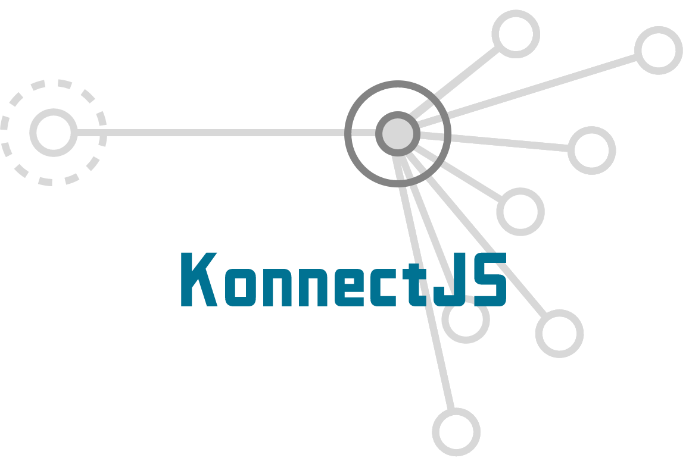

KonnectJS 是一个非常灵活的基于结点和连接的抽象架构。专门为面向连接的应用而设计，可以随意切换各种网络协议

此项目尚处于开发中，这意味着：
* 接口可能发生破坏性变化
* 文档和教程错误
* 部分未覆盖的用例无法通过
* 存在bug和功能缺陷

目录
<!-- vscode-markdown-toc -->
- [概念](#概念)
  - [Konnection \& Knode](#konnection--knode)
  - [Impl](#impl)
- [功能](#功能)
- [安装](#安装)
- [开始认识](#开始认识)
  - [运行一个WS服务器](#运行一个ws服务器)
  - [运行一个Tcp服务器](#运行一个tcp服务器)
  - [连接会话](#连接会话)
  - [手动触发事件](#手动触发事件)
  - [多种类连接](#多种类连接)
- [层叠式中间件](#层叠式中间件)
- [Low Level 事件系统](#low-level-事件系统)
  - [Knode和Konnection事件系统](#knode和konnection事件系统)
  - [中间件事件类型](#中间件事件类型)
- [使用中间件](#使用中间件)
  - [修改默认IO格式 SetIOType](#修改默认io格式-setiotype)
  - [过滤消息种类 FilterEvent](#过滤消息种类-filterevent)
- [自定义中间件](#自定义中间件)
  - [一个简单的JSON中间件](#一个简单的json中间件)
  - [重定义IO为Json的中间件](#重定义io为json的中间件)
  - [自动转发中间件](#自动转发中间件)
- [扩展自定义实现](#扩展自定义实现)

<!-- vscode-markdown-toc-config
	numbering=true
	autoSave=true
	/vscode-markdown-toc-config -->
<!-- /vscode-markdown-toc -->

## 概念

### Konnection & Knode

KonnectJS 有两个主要的概念 'Konnection' 和 'Knode'。 
'Konnection' 与 'Connection' 发音相同(下文不再区分)；
'Knode' 与 'Node' 发音相同(下文不再区分)。
连接的端点被称为结点； 一个结点可以有多个连接。


### Impl

KonnectJS 只关心抽象的逻辑结构，并处理在这个结构上的事件。 也就是说, KonnectJS 需要有专门的外部驱动者。 通过调用 `setImpl`. 
大多数情况下，Impl是一个特定的网络协议。**但是这并不意味着Impl只能是网络协议**.


## 功能
KonnectJS适用的一些场景举例如下：
* 尚不确定使用何种网络协议、或协议需要灵活切换的场景
* 使用express、koa编写的代码希望轻松转为面向连接网络协议的场景
* 希望找到一种方式让业务代码近乎完全解耦的场景
* 希望使用类似express、koa编程方式开发面向连接应用的场景
* 希望使用传统事件机制方式开发面向连接应用的场景
* 等等

对于业务代码，只需要定义如何响应对应的事件:

* connection - 连接建立
* close - 连接关闭
* data - 数据传输
* error - 错误发生

有时一些简单场景，开发者不必关系与业务逻辑无关的繁琐事务。如使用何种网络协议，何种数据解析，何种加密方式，甚至是如何握手等等。下面这些内容使用KonnectJS只需要一行代码就可以切换:

* 何种通信协议。 如 `websocket`， `tcp`， `udp`， `sse`， `polling`， `kcp`，`http3` 或任意其他自定义实现，参考 [扩展自定义实现](#扩展自定义实现)
    > 无连接的网络协议：
    > 
    > 对于基于请求应答的无连接通信方式，如：http，KonnectJS也可以支持。只需要提前配置好中间件，甚至能够毫无察觉的对接到Koa或Express应用中，对于大部分逻辑简单的业务代码都可以无缝切换。由于KonnectJS侧重于有连接的通信实现，此类内容放在后续完善。
  
* 何种数据解析格式。如 `json`, `bson`, `buffer`, `string`, `protobuf` 或其他自定义格式，参考 [自定义中间件](#自定义中间件)
* 如何真正的建立连接。如自定义握手，自定义认证等
* 及其他各种

## 安装
clone the source code:
```sh
> git clone git@github.com:labbbirder/KonnectJS.git
```
or install from npmjs:
```sh
> npm i -S KonnectJS
```
when you installed the project successfully, it's time to import to your script:
```typescript
import { Knode,Konnection } from 'KonnectJS'
```
## 开始认识
### 运行一个WS服务器
the code below illustrates how a websocket server is created:
```typescript
import { Knode,Konnection } from 'KonnectJS'
import { KonnectWS } from 'Konnect-ws'

let node = new Knode()
.setImpl(KonnectWS({ port:3000 })) // 在3000端口监听，使用ws通信
.use(()=>ctx=>{
    console.log("websocket message", ctx.eventType, ctx.data)
})
```
### 运行一个Tcp服务器
the code below illustrates how a tcp server is created:
```typescript
import { Knode,Konnection } from 'KonnectJS'
import { KonnectTCP } from 'Konnect-tcp'

let node = new Knode()
.use(()=>ctx=>{
    console.log("tcp data", ctx.eventType, ctx.data)
})
.setImpl(KonnectTCP({ port:3000 })) // 可以任何时刻调用setImpl
```
### 连接会话
And you may want to know who the connection is, and want some code persistent for the same connection to be retrieved, here is the example:
```typescript
import { Knode,Konnection } from 'KonnectJS'
import { KonnectTCP } from 'Konnect-tcp'

let node = new Knode()
.use(()=>{
    // for a new connection here...
    let session = {}
    let lastEventTime = 0

    return ctx=>{ // the returned function is called every time the connection emits
        if(!!lastEventTime){
            console.log("i remember you", ctx.eventType, ctx.data)// we can retrieve here
            console.log("last message from you is on", lastEventTime)
        }else{
            console.log("hello, new connection")
        }
        session.data = ctx.data
        lastEventTime = Date.now()
    }
})
.setImpl(KonnectTCP({ port:3000 })) 
```
The scope of `let session = {}` is initialized the time as the connection established. The data under the scope is saved respectively.
### 手动触发事件
this example shows how to drive it manually:
```typescript
import { Knode,Konnection } from 'KonnectJS'

let node = new Knode()
node.use(()=>(ctx)=>{
    console.log(ctx)
})

let conn = new Konnection(node)
node.emit("connection",conn) // establish a connection manually
conn.emit("data","hello there") // transfer a data via connection manually
```
### 多种类连接
有时候额外需要一个到内部服务器的单独连接，运行着不同的逻辑。这是例子:

```typescript
import { Knode,Konnection } from 'KonnectJS'
import { KonnectTCP } from 'Konnect-tcp'

let node = new Knode()
.use(()=>{
    // 到各个客户端的连接
    console.log("hello, new connection from client")
    return ctx=>{
        ctx.conn.send("you are a client")
    }
})
.setImpl(KonnectTCP({ port:3000 })) 

let connA = new Konnection(node) // 到内部服务器的独立连接
connA.connectTo({host:"127.0.0.1",port:3001})
connA.use((ctx,next)=>{
    if(ctx.data==="who am I"){
        connA.send("you are gate server")
    }
})
```
## 层叠式中间件
the midware here is similar to which of [koa](https://github.com/koajs/koa)

```typescript
import { Knode,Konnection } from 'KonnectJS'
const sleep = (ms:number)=>new Promise(res=>setTimeout(res,ms))

let node = new Knode()
node.setImpl(KonnectWS({ port:3000 })) 
.use(()=>async (ctx,next)=>{
    console.log("start")
    await next()
    console.log("end")
})
.use(()=>async (ctx,next)=>{
    await sleep(3000)
    console.log("good")
})
.use(()=>async (ctx,next)=>{
    console.log("you wont see this")
})

```
## Low Level 事件系统
KonnectJS可以使用一套内部的Api进行开发，即一套基于Event Emitter的事件系统。

层叠式中间组件架设在事件系统之上，两个又互为补充。

如果您需要进行高度DIY，Low Level事件系统是必不可少的。
### Knode和Konnection事件系统
Knode 事件
* connection - 新连接
  
Konnection 事件
* data - 收到数据
* close - 连接关闭
* error - 连接发生错误

我们可以像这样使用这套接口：
```typescript
new Knode().on("connection",conn=>{
    conn.on("data",data=>{
        console.log("received",conn,data)
    })
})
```

### 中间件事件类型
不同于Knode和Konnection绑定的事件种类，中间件使用的是扁平化的事件设计：
* connection - 新连接
* data - 收到数据
* close - 连接关闭
* error - 连接错误
* form - 打包一个收到的数据数据到应用内
* unform - 解包一个将要发送的数据包

## 使用中间件
我们可以自己设计、或者通过网络安装他人设计的中间件。实现到应用模块的无缝化界面。KonnectJS正是通过这种机制实现业务代码的最大程度解耦。
### 修改默认IO格式 SetIOType

对于一个Context对象，dataIn和dataOut默认为any类型。如果我们希望在恰当的时候指定数据类型是可行的。我们通常用中间件`ReformInput`、`ReformOutput`、`ReformIO`来做到这一点。
```typescript
new Knode()
.use(()=>ctx=>{
    ctx.dataIn // type is any by default
    ctx.dataOut // type is any by default
})
.use(ReformInput<Buffer>())
.use(()=>ctx=>{
    ctx.dataIn // type is Buffer
    ctx.dataOut // type is any
})
.use(ReformIO<string,string>(b=>b.toString()))
.use(()=>ctx=>{
    ctx.dataIn // type is string
    ctx.dataOut // type is string
})
```
### 过滤消息种类 FilterEvent
有时我们对于一些消息不再关心，使用内置的中间件`FilterEvent`会起到帮助.

FilterEvent接收2个参数，一个参数指明过滤的消息类型列表；第二个参数可以用过exclude字段表明是白名单模式还是黑名单模式。
```typescript
new Knode()
.use(()=>ctx=>{
    if(ctx.eventType==="form") console.log("pack up a raw data")
})
.use(FilterEvent,["form","unform"],{exclude:true})
.use(()=>ctx=>{
    if(ctx.eventType==="form") console.log("you wont see me")
})
```

## 自定义中间件
有时我们需要设计DIY的中间件，并在其他地方使用。大多数情况需要使用defineMidware 函数。

defineMidware 只是简单的返回原函数，但是会在代码编辑器中引入类型提示。

下文通过例子说明：
### 一个简单的JSON中间件
此示例在Context上定义了一个json字段。当收到消息时自动写入json对象。这在同时需要多种解析格式时很有用，比如在Context同时访问json、proto、buffer。json示例如下：
```typescript
// json.d.ts
interface Context{
    json?:object; //扩展自定义字段
}
```
```typescript
import { Knode,Konnection } from 'KonnectJS'

// how it transforms
export let JsonParser = defineMidware((useUnform:boolean=true)=>async (ctx,next)=>{
    if(ctx.eventType==="form"){ // reform a data from connection
        ctx.json = JSON.parse(ctx.dataIn)
    }
    await next()
    if(ctx.eventType==="unform"){ // unform a data to connection
        if(useUnform) ctx.dataOut = JSON.stringify(ctx.dataOut)
    }
})

let node = new Knode()
.setImpl(KonnectWS({ port:3000 })) // use your midware
.use(JsonParser,/*useUnform*/true)
.use(async (ctx,next)=>{
    console.log("data in json", ctx.json)
    ctx.conn.send({
        msg: "i can send json directly"
    })
})

```
### 重定义IO为Json的中间件
我们可以通过中间件告诉应用通过网络发送和接受的消息是什么样子的（默认为any）。比如：我们希望在一系列连接上直接发送和接受Protobuf结构体，或是使用Json等等。
```typescript
type InCommingJson = {
    cmd:string,
    nonce?:string,
    [k:string]:any,
}

type OutCommingJson = {
    cmd:string,
    errcode:number,
    errmsg?:string,
    nonce?:string,
    [k:string]:any,
}

let KonnectJSON = defineMidware((useUnform:boolean=true)=>{
    return (ctx,next)=>{
        if(ctx.eventType=="form"){
            ctx.dataIn = JSON.parse(ctx.dataIn.toString())
        }
        if(ctx.eventType=="unform"){
            if(useUnform) ctx.dataOut = JSON.stringify(ctx.dataOut)
        }
        return next() as SetContextType<"TIO",InCommingJson,OutCommingJson>
    }
})

let node = new Knode()
.use(KonnectJSON,true)
.use(FilterEvent,["data"])
.use(()=>ctx=>{
    if(ctx.dataIn.cmd==="getName"){
        ctx.conn.send({
            cmd:"getName",
            errcode:0,
            name:"bbbirder"
        })
    }
    console.log(ctx.eventType,ctx.dataIn)
})
```
这个例子使用了`SetContextType`，当中间件需要重新指定IO类型时需要用到它。`SetContextType`接收3个参数。第一个参数指定目标类型,有`TI TO TIO`三个选项，如：
```typescript
SetContextType<"TI",MyClassA> //指定接收的数据格式为MyClassA
SetContextType<"TO",MyClassB> //指定发送的数据格式为MyClassB
SetContextType<"TIO",MyClassA,MyClassB> //指定接收的数据格式为MyClassA，发送的数据格式为MyClassB
```
### 自动转发中间件
此实例实现了一个收到消息后，自动转发给其他连接的功能。
```typescript
import { Knode,Konnection } from 'KonnectJS'
let Transmit = defineMidware(function(){
    return (ctx,next)=>{
        if(ctx.eventType==="data"){
            this.broadcast(ctx.conn,ctx.dataIn) //广播，除了ctx.conn
        }
        next()
    }
})
```
如上可以看到，如果使用`function() {}`形式传入defineMidware，在回调中可以通过this关键字取得Knode实例。
## 扩展自定义实现
On the most time, you'll need `defineImpl` function.
here is an example of websocket implement:
```typescript
import { WebSocketServer } from "ws"
import { Konnection, defineImpl } from "./KonnectJS/Konnect"


function setupWebSocket(ws:WebSocket,conn:Konnection){
    ws.on("message",(data:Buffer)=>{
        conn.emit("data",data)
    })
    ws.on("close",(code,reason)=>{
        conn.emit("close",reason)
    })
    ws.on("error",err=>{
        conn.emit("error",err)
    })
}

export let KonnectWS = (defineImpl((wss?:WebSocketServer)=>(node)=>{
    wss?.on("connection",ws=>{
        let conn = new Konnection(node,ws)
        setupWebSocket(ws,conn)
        node.emit("connection",conn)
    })
    return {
        closeConnection(conn:WSConnection,reason){
            conn.raw.close(reason?.code,reason?.reason)
            return true
        },
        sendTo(conn:WSConnection,data) {
            conn.raw.send(data)
            return true
        },
        connectTo(conn:WSConnection,addr){
            conn.raw = new WebSocket(addr.url||"")
            conn.raw.on("open",()=>{
                node.emit("connection",conn)
            })
            setupWebSocket(conn.raw,conn)
            return true
        },
    }
})) 
```
defineImpl 只是简单的返回原函数，但是会在代码编辑器中引入类型提示。